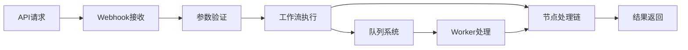

# n8n工作流API调用能力分析

## 📡 API调用方式总览

n8n提供多种方式来实现工作流的API调用，满足不同的使用场景需求。

### 1. Webhook触发 (推荐) ✅

**核心特点：**
- 最直接的API调用方式
- 自动生成唯一webhook URL
- 支持JSON数据传递
- 同步/异步响应模式可选

**实现示例：**
```bash
# API调用
POST https://your-n8n-instance.com/webhook/rss-news-processor
Content-Type: application/json

{
  "category": "technology",
  "rssSource": "solidot", 
  "index": 0,
  "border": "0"
}

# 响应 (同步模式)
{
  "success": true,
  "result": "https://device-api/image/abc123.png",
  "executionTime": 1247,
  "metadata": {
    "workflowId": "rss-workflow-001",
    "executionId": "exec_1756123456"
  }
}
```

**配置方式：**
```typescript
// Webhook节点配置
const webhookNode = {
  name: "API入口",
  type: "n8n-nodes-base.webhook", 
  parameters: {
    httpMethod: "POST",
    path: "rss-news-api",
    responseMode: "lastNode", // 同步返回最后节点结果
    authentication: "none"    // 可配置认证
  }
};
```

### 2. 工作流管理器API ✅

**使用场景：** 需要动态调用不同工作流时使用

```typescript
// 通用工作流调用API
POST https://your-n8n-instance.com/webhook/workflow-manager
{
  "workflowId": "rss-news-workflow-123",
  "data": {
    "category": "technology",
    "rssSource": "solidot"
  },
  "options": {
    "timeout": 30000,
    "async": false
  }
}
```

**实现原理：**
- 使用社区提供的工作流管理器模板
- 通过webhook接收工作流ID和参数
- 内部调用Execute Workflow节点执行目标工作流

### 3. 子工作流调用 ✅

**使用场景：** 工作流内部调用其他工作流

```typescript
// Execute Workflow节点配置
{
  "node": "调用RSS处理流程",
  "type": "n8n-nodes-base.executeWorkflow",
  "parameters": {
    "workflowId": "rss-processing-workflow-456",
    "data": "={{$json}}"  // 传递当前数据
  }
}
```

### 4. 直接REST API调用 ⚠️

**现状：** n8n公共API不直接支持工作流执行，但可通过内部端点实现

```javascript
// n8n内部API (非官方)
POST /rest/workflows/run
{
  "workflowId": "123",
  "runData": {}
}
```

**注意：** 此方式不推荐用于生产环境，建议使用webhook方式。

## 🔧 API调用配置详解

### 响应模式配置

```typescript
// 1. 立即响应 (异步执行)
responseMode: "immediately"
// 响应时间: ~50ms
// 返回: { "message": "Workflow started", "executionId": "xxx" }

// 2. 等待完成 (同步执行) 
responseMode: "lastNode"  
// 响应时间: 实际执行时间 (1-5秒)
// 返回: 最后节点的输出数据

// 3. 等待任意节点
responseMode: "responseNode"
responseData: "firstEntryBinary" // 或其他选项
```

### 认证和安全配置

```typescript
// 基础认证
authentication: "basicAuth"
basicAuthUser: "api-user"
basicAuthPassword: "secure-password"

// 头部认证
authentication: "headerAuth" 
headerAuthName: "X-API-Key"
headerAuthValue: "your-api-key"

// 无认证 (内网使用)
authentication: "none"
```

### 错误处理

```typescript
// 工作流级错误处理
const errorHandler = {
  name: "错误处理",
  type: "n8n-nodes-base.set",
  parameters: {
    values: {
      boolean: [],
      number: [],
      string: [
        {
          name: "error",
          value: "={{$json.error || '执行失败'}}"
        }
      ]
    }
  },
  onError: "continueRegularOutput"
};
```

## 📊 API性能特征

### 请求处理流程



### 性能指标

| 响应模式 | 延迟 | 吞吐量 | 适用场景 |
|----------|------|--------|----------|
| 立即响应 | 20-50ms | 100+ req/s | 异步处理，快速响应 |
| 同步响应 | 0.5-5s | 10-30 req/s | 需要处理结果的场景 |
| 复杂工作流 | 1-10s | 5-15 req/s | 多步骤复杂处理 |

### 针对RSS新闻场景的性能预估

```typescript
// 您的工作流步骤
const workflowSteps = [
  { name: "RSS获取", estimatedTime: 200 },      // ms
  { name: "AX处理", estimatedTime: 800 },       // ms  
  { name: "图片渲染", estimatedTime: 300 },     // ms
  { name: "设备推送", estimatedTime: 150 }      // ms
];

// 总预估时间: 1.45秒
// 推荐并发: 10-15 req/min
// 峰值处理: 30 req/min (队列模式)
```

## 🛠️ 最佳实践

### 1. API设计建议

```typescript
// 标准化API响应格式
interface APIResponse {
  success: boolean;
  data?: any;
  error?: string;
  executionTime: number;
  workflowId: string;
  executionId: string;
}

// 工作流内统一响应格式
const responseFormatter = {
  name: "格式化响应",
  type: "n8n-nodes-base.function",
  parameters: {
    functionCode: `
      return [{
        json: {
          success: items[0].json.success !== false,
          data: items[0].json,
          executionTime: Date.now() - $execution.startedAt,
          workflowId: $workflow.id,
          executionId: $execution.id
        }
      }];
    `
  }
};
```

### 2. 参数验证

```typescript
// 输入验证节点
const validateInput = {
  name: "参数验证",
  type: "n8n-nodes-base.function",
  parameters: {
    functionCode: `
      const required = ['category', 'rssSource'];
      const data = items[0].json;
      
      for (const field of required) {
        if (!data[field]) {
          throw new Error(\`缺少必需参数: \${field}\`);
        }
      }
      
      // 参数标准化
      data.category = data.category.toLowerCase();
      data.index = parseInt(data.index) || 0;
      
      return [{ json: data }];
    `
  }
};
```

### 3. 错误处理和重试

```typescript
// 带重试的节点配置
const rssNodeWithRetry = {
  name: "RSS获取(带重试)",
  type: "rss-data-source",
  parameters: {
    // RSS参数
  },
  retryOnFail: {
    enabled: true,
    maxRetries: 3,
    waitBetween: 1000
  },
  onError: "continueErrorOutput"
};
```

## 🔄 集成示例

### cURL调用示例

```bash
# 基础调用
curl -X POST https://your-n8n.com/webhook/rss-news \
  -H "Content-Type: application/json" \
  -d '{
    "category": "technology",
    "rssSource": "solidot",
    "index": 0
  }'

# 带认证调用  
curl -X POST https://your-n8n.com/webhook/rss-news \
  -H "Content-Type: application/json" \
  -H "X-API-Key: your-secret-key" \
  -d '{"category": "technology"}'

# 异步调用
curl -X POST https://your-n8n.com/webhook/rss-news?mode=async \
  -H "Content-Type: application/json" \
  -d '{"category": "finance"}'
```

### Node.js/TypeScript集成

```typescript
class N8nWorkflowClient {
  constructor(private baseUrl: string, private apiKey?: string) {}
  
  async executeRSSWorkflow(params: {
    category: string;
    rssSource?: string;
    index?: number;
    border?: '0' | '1';
  }): Promise<any> {
    const headers: Record<string, string> = {
      'Content-Type': 'application/json'
    };
    
    if (this.apiKey) {
      headers['X-API-Key'] = this.apiKey;
    }
    
    const response = await fetch(`${this.baseUrl}/webhook/rss-news`, {
      method: 'POST',
      headers,
      body: JSON.stringify(params)
    });
    
    if (!response.ok) {
      throw new Error(`API调用失败: ${response.statusText}`);
    }
    
    return await response.json();
  }
}

// 使用示例
const client = new N8nWorkflowClient('https://your-n8n.com', 'api-key');
const result = await client.executeRSSWorkflow({
  category: 'technology',
  rssSource: 'solidot'
});
```

## ✅ 总结

**n8n完全支持工作流的API调用，且功能丰富：**

- ✅ **多种调用方式**: Webhook、工作流管理器、子工作流
- ✅ **灵活响应模式**: 同步/异步可选
- ✅ **完整的参数传递**: JSON数据无缝传递
- ✅ **企业级功能**: 认证、错误处理、重试机制
- ✅ **性能可接受**: 对于RSS新闻场景完全够用

**推荐方案：** 使用Webhook触发作为主要API调用方式，配合适当的认证和错误处理机制。