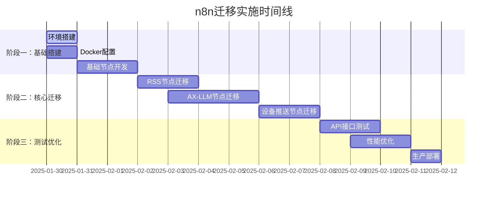

# n8n实施方案和架构设计

## 🎯 实施总体规划

### 分阶段迁移策略



## 🏗️ 架构设计方案

### 整体架构图

```
┌─────────────────────────── n8n生产架构 ───────────────────────────┐
│                                                                  │
│  ┌─────────────┐    ┌─────────────┐    ┌─────────────┐          │
│  │   Nginx     │    │ n8n-webhook │    │ n8n-main    │          │
│  │ 负载均衡器   │───▶│   实例      │───▶│    实例     │          │
│  │             │    │ (API入口)   │    │ (UI管理)    │          │
│  └─────────────┘    └─────────────┘    └─────────────┘          │
│                              │                │                  │
│                              ▼                ▼                  │
│  ┌─────────────────────────────────────────────────────────────┐ │
│  │                   Redis 队列系统                            │ │
│  │  ┌─────────────┐ ┌─────────────┐ ┌─────────────┐          │ │
│  │  │ Job Queue   │ │ Bull Queue  │ │ Cache Store │          │ │
│  │  └─────────────┘ └─────────────┘ └─────────────┘          │ │
│  └─────────────────────────────────────────────────────────────┘ │
│                              │                                   │
│                              ▼                                   │
│  ┌─────────────┐    ┌─────────────┐    ┌─────────────┐          │
│  │n8n-worker-1 │    │n8n-worker-2 │    │n8n-worker-3 │          │
│  │   RSS节点    │    │  AX-LLM节点  │    │  渲染节点    │          │
│  └─────────────┘    └─────────────┘    └─────────────┘          │
│                              │                                   │
│                              ▼                                   │
│  ┌─────────────────────── 外部服务 ──────────────────────────┐   │
│  │ ┌─────────────┐ ┌─────────────┐ ┌─────────────┐          │   │
│  │ │ PostgreSQL  │ │    MinIO    │ │ MindReset   │          │   │
│  │ │  数据存储   │ │  对象存储   │ │   设备API   │          │   │
│  │ └─────────────┘ └─────────────┘ └─────────────┘          │   │
│  └─────────────────────────────────────────────────────────────┘   │
│                                                                  │
└──────────────────────────────────────────────────────────────────┘
```

### Docker Compose配置

```yaml
# docker-compose.prod.yml
version: '3.8'

services:
  # Nginx负载均衡器
  nginx:
    image: nginx:alpine
    ports:
      - "80:80"
      - "443:443"
    volumes:
      - ./nginx.conf:/etc/nginx/nginx.conf
      - ./ssl:/etc/nginx/ssl
    depends_on:
      - n8n-webhook
    restart: unless-stopped

  # n8n主实例 (UI管理)
  n8n-main:
    image: n8nio/n8n:latest
    environment:
      - DB_TYPE=postgresdb
      - DB_POSTGRESDB_HOST=postgres
      - DB_POSTGRESDB_DATABASE=n8n
      - DB_POSTGRESDB_USER=n8n
      - DB_POSTGRESDB_PASSWORD=${POSTGRES_PASSWORD}
      - N8N_EXECUTIONS_MODE=queue
      - N8N_QUEUE_BULL_REDIS_HOST=redis
      - N8N_BASIC_AUTH_ACTIVE=true
      - N8N_BASIC_AUTH_USER=${N8N_AUTH_USER}
      - N8N_BASIC_AUTH_PASSWORD=${N8N_AUTH_PASSWORD}
      - N8N_HOST=${N8N_HOST}
      - N8N_PROTOCOL=https
      - WEBHOOK_URL=${WEBHOOK_URL}
      - GENERIC_TIMEZONE=${TIMEZONE}
    volumes:
      - ./custom-nodes/dist:/home/node/.n8n/custom/node_modules/mindreset-nodes
      - n8n_data:/home/node/.n8n
    depends_on:
      - postgres
      - redis
    restart: unless-stopped

  # n8n Webhook实例 (API专用)
  n8n-webhook:
    image: n8nio/n8n:latest
    environment:
      - DB_TYPE=postgresdb
      - DB_POSTGRESDB_HOST=postgres
      - DB_POSTGRESDB_DATABASE=n8n
      - DB_POSTGRESDB_USER=n8n
      - DB_POSTGRESDB_PASSWORD=${POSTGRES_PASSWORD}
      - N8N_DISABLE_UI=true
      - N8N_EXECUTIONS_MODE=queue
      - N8N_QUEUE_BULL_REDIS_HOST=redis
      - WEBHOOK_URL=${WEBHOOK_URL}
      - GENERIC_TIMEZONE=${TIMEZONE}
    volumes:
      - ./custom-nodes/dist:/home/node/.n8n/custom/node_modules/mindreset-nodes
    depends_on:
      - postgres
      - redis
    restart: unless-stopped

  # n8n Worker实例 (可扩展)
  n8n-worker:
    image: n8nio/n8n:latest
    environment:
      - DB_TYPE=postgresdb
      - DB_POSTGRESDB_HOST=postgres
      - DB_POSTGRESDB_DATABASE=n8n
      - DB_POSTGRESDB_USER=n8n
      - DB_POSTGRESDB_PASSWORD=${POSTGRES_PASSWORD}
      - N8N_EXECUTIONS_PROCESS=worker
      - N8N_QUEUE_BULL_REDIS_HOST=redis
      - GENERIC_TIMEZONE=${TIMEZONE}
    volumes:
      - ./custom-nodes/dist:/home/node/.n8n/custom/node_modules/mindreset-nodes
    depends_on:
      - postgres
      - redis
    deploy:
      replicas: 3
    restart: unless-stopped

  # Redis队列和缓存
  redis:
    image: redis:7-alpine
    command: redis-server --appendonly yes --maxmemory 1gb --maxmemory-policy allkeys-lru
    volumes:
      - redis_data:/data
    restart: unless-stopped

  # PostgreSQL数据库
  postgres:
    image: postgres:15
    environment:
      - POSTGRES_DB=n8n
      - POSTGRES_USER=n8n
      - POSTGRES_PASSWORD=${POSTGRES_PASSWORD}
    volumes:
      - postgres_data:/var/lib/postgresql/data
    restart: unless-stopped

  # MinIO对象存储
  minio:
    image: minio/minio
    command: server /data --console-address ":9001"
    environment:
      - MINIO_ACCESS_KEY=${MINIO_ACCESS_KEY}
      - MINIO_SECRET_KEY=${MINIO_SECRET_KEY}
    ports:
      - "9000:9000"
      - "9001:9001"
    volumes:
      - minio_data:/data
    restart: unless-stopped

volumes:
  n8n_data:
  redis_data:
  postgres_data:
  minio_data:
```

## 📦 自定义节点开发

### 项目结构

```
custom-nodes/
├── package.json
├── tsconfig.json
├── src/
│   ├── nodes/
│   │   ├── RSS/
│   │   │   ├── RSSDataSource.node.ts
│   │   │   └── RSSDataSource.node.json
│   │   ├── AX/
│   │   │   ├── AXProcessing.node.ts
│   │   │   └── AXProcessing.node.json
│   │   └── Device/
│   │       ├── DeviceRender.node.ts
│   │       └── DeviceRender.node.json
│   ├── credentials/
│   │   ├── MinIOApi.credentials.ts
│   │   └── MindResetApi.credentials.ts
│   └── shared/
│       ├── rss-data-source.ts      # 复用现有模块
│       ├── ax-processing.ts        # 复用现有模块
│       └── device-client.ts        # 复用现有模块
└── dist/
```

### RSS数据源节点实现

```typescript
// src/nodes/RSS/RSSDataSource.node.ts
import { INodeType, INodeTypeDescription, IExecuteFunctions, INodeExecutionData } from 'n8n-workflow';
import { RSSDataSourceModule } from '../../shared/rss-data-source.js';

export class RSSDataSourceNode implements INodeType {
  description: INodeTypeDescription = {
    displayName: 'RSS数据源',
    name: 'rssDataSource',
    icon: 'fa:rss',
    group: ['input'],
    version: 1,
    subtitle: '={{$parameter["source"]}}',
    description: '获取RSS订阅源数据，支持多个预设源',
    defaults: {
      name: 'RSS数据源',
    },
    inputs: [],
    outputs: ['main'],
    properties: [
      {
        displayName: 'RSS源',
        name: 'source',
        type: 'options',
        options: [
          { name: 'Solidot', value: 'solidot' },
          { name: '少数派', value: 'sspai' },
          { name: '36氪', value: '36kr' },
          { name: 'TechCrunch', value: 'techcrunch' },
          { name: 'Ars Technica', value: 'arstechnica' }
        ],
        default: 'solidot',
        description: '选择预设RSS订阅源'
      },
      {
        displayName: '分类',
        name: 'category',
        type: 'options',
        options: [
          { name: '科技', value: 'technology' },
          { name: '商业', value: 'business' },
          { name: '设计', value: 'design' },
          { name: '编程', value: 'programming' }
        ],
        default: 'technology'
      },
      {
        displayName: '获取数量',
        name: 'count',
        type: 'number',
        typeOptions: {
          minValue: 1,
          maxValue: 50
        },
        default: 10,
        description: '获取文章数量 (1-50)'
      },
      {
        displayName: '开始索引',
        name: 'startIndex',
        type: 'number',
        typeOptions: {
          minValue: 0
        },
        default: 0,
        description: '开始获取的索引位置'
      },
      {
        displayName: '启用缓存',
        name: 'enableCache',
        type: 'boolean',
        default: true,
        description: '启用5分钟缓存以提高性能'
      }
    ]
  };

  async execute(this: IExecuteFunctions): Promise<INodeExecutionData[][]> {
    const items = this.getInputData();
    const returnData: INodeExecutionData[] = [];

    // 获取参数
    const source = this.getNodeParameter('source', 0) as string;
    const category = this.getNodeParameter('category', 0) as string;
    const count = this.getNodeParameter('count', 0) as number;
    const startIndex = this.getNodeParameter('startIndex', 0) as number;
    const enableCache = this.getNodeParameter('enableCache', 0) as boolean;

    try {
      // 实例化RSS模块 (复用现有逻辑)
      const rssModule = new RSSDataSourceModule();
      
      // 构建参数
      const params = {
        source,
        category,
        count,
        startIndex
      };

      // 缓存检查
      const cacheKey = `rss-${source}-${startIndex}-${count}`;
      if (enableCache) {
        // 检查Redis缓存 (如果配置了)
        const cached = await this.helpers.redis?.get(cacheKey);
        if (cached) {
          const cachedData = JSON.parse(cached);
          return [cachedData.map((item: any) => ({ json: item }))];
        }
      }

      // 获取RSS数据
      const rawData = await rssModule.fetchRawData(params);

      // 缓存结果
      if (enableCache && this.helpers.redis) {
        await this.helpers.redis.setex(cacheKey, 300, JSON.stringify(rawData)); // 5分钟缓存
      }

      // 转换为n8n数据格式
      for (const item of rawData) {
        returnData.push({
          json: item,
          binary: undefined
        });
      }

      return [returnData];

    } catch (error) {
      // 错误处理
      if (this.continueOnFail()) {
        return [[{
          json: {
            error: error instanceof Error ? error.message : '未知错误',
            source,
            timestamp: new Date().toISOString()
          }
        }]];
      }
      throw error;
    }
  }
}
```

### AX处理节点实现

```typescript
// src/nodes/AX/AXProcessing.node.ts
import { INodeType, INodeTypeDescription, IExecuteFunctions, INodeExecutionData } from 'n8n-workflow';
import { processingRegistry } from '../../shared/processing-modules.js';

export class AXProcessingNode implements INodeType {
  description: INodeTypeDescription = {
    displayName: 'AX智能处理',
    name: 'axProcessing',
    icon: 'fa:brain',
    group: ['transform'],
    version: 1,
    subtitle: '={{$parameter["processor"]}}',
    description: '使用AX框架智能处理新闻内容',
    defaults: {
      name: 'AX处理',
    },
    inputs: ['main'],
    outputs: ['main'],
    properties: [
      {
        displayName: '处理器类型',
        name: 'processor',
        type: 'options',
        options: [
          { name: 'AX优化处理器', value: 'ax-optimized' },
          { name: '基础LLM处理器', value: 'basic-llm' },
          { name: '直通处理器', value: 'passthrough' }
        ],
        default: 'ax-optimized',
        description: '选择处理器类型'
      },
      {
        displayName: '最大标题长度',
        name: 'maxTitleLength',
        type: 'number',
        typeOptions: {
          minValue: 10,
          maxValue: 100
        },
        default: 20,
        description: '优化后标题的最大字符长度'
      },
      {
        displayName: '最大内容长度',
        name: 'maxContentLength',
        type: 'number',
        typeOptions: {
          minValue: 50,
          maxValue: 500
        },
        default: 150,
        description: '优化后内容的最大字符长度'
      },
      {
        displayName: 'LLM温度',
        name: 'temperature',
        type: 'number',
        typeOptions: {
          numberPrecision: 1,
          minValue: 0,
          maxValue: 1
        },
        default: 0.3,
        description: 'LLM生成的随机性控制 (0-1)'
      }
    ]
  };

  async execute(this: IExecuteFunctions): Promise<INodeExecutionData[][]> {
    const items = this.getInputData();
    const returnData: INodeExecutionData[] = [];

    // 获取参数
    const processor = this.getNodeParameter('processor', 0) as string;
    const maxTitleLength = this.getNodeParameter('maxTitleLength', 0) as number;
    const maxContentLength = this.getNodeParameter('maxContentLength', 0) as number;
    const temperature = this.getNodeParameter('temperature', 0) as number;

    // 获取处理模块
    const processingModule = processingRegistry.get(processor);
    if (!processingModule) {
      throw new Error(`处理器不存在: ${processor}`);
    }

    // 处理每个输入项
    for (let i = 0; i < items.length; i++) {
      try {
        const item = items[i];
        const inputData = item.json;

        // 构建处理参数
        const params = {
          maxTitleLength,
          maxContentLength,
          temperature
        };

        // 缓存检查 (LLM处理结果缓存1小时)
        const cacheKey = `llm-${processor}-${this.hashObject(inputData)}-${this.hashObject(params)}`;
        const cached = await this.helpers.redis?.get(cacheKey);
        
        if (cached) {
          const cachedResult = JSON.parse(cached);
          returnData.push({
            json: cachedResult,
            binary: item.binary
          });
          continue;
        }

        // 执行处理
        const processedData = await processingModule.processData(inputData, params);

        // 缓存结果
        if (this.helpers.redis) {
          await this.helpers.redis.setex(cacheKey, 3600, JSON.stringify(processedData)); // 1小时缓存
        }

        returnData.push({
          json: processedData,
          binary: item.binary
        });

      } catch (error) {
        if (this.continueOnFail()) {
          returnData.push({
            json: {
              error: error instanceof Error ? error.message : '处理失败',
              originalData: items[i].json
            }
          });
        } else {
          throw error;
        }
      }
    }

    return [returnData];
  }

  private hashObject(obj: any): string {
    return require('crypto').createHash('md5').update(JSON.stringify(obj)).digest('hex');
  }
}
```

### 设备推送节点实现

```typescript
// src/nodes/Device/DeviceRender.node.ts
import { INodeType, INodeTypeDescription, IExecuteFunctions, INodeExecutionData } from 'n8n-workflow';
import { renderingRegistry } from '../../shared/rendering-modules.js';
import { ImageSender } from '../../shared/image-sender.js';

export class DeviceRenderNode implements INodeType {
  description: INodeTypeDescription = {
    displayName: '设备推送',
    name: 'deviceRender',
    icon: 'fa:mobile-alt',
    group: ['output'],
    version: 1,
    description: '渲染内容并推送到MindReset设备',
    defaults: {
      name: '设备推送',
    },
    inputs: ['main'],
    outputs: ['main'],
    credentials: [
      {
        name: 'mindResetApi',
        required: true
      }
    ],
    properties: [
      {
        displayName: '边框样式',
        name: 'border',
        type: 'options',
        options: [
          { name: '白色边框', value: '0' },
          { name: '黑色边框', value: '1' }
        ],
        default: '0',
        description: '设备显示的边框颜色'
      },
      {
        displayName: '渲染模式',
        name: 'renderMode',
        type: 'options',
        options: [
          { name: '设备推送', value: 'device' },
          { name: '图片URL', value: 'image' },
          { name: 'MinIO存储', value: 'minio' }
        ],
        default: 'device',
        description: '选择输出方式'
      },
      {
        displayName: '图片质量',
        name: 'imageQuality',
        type: 'options',
        options: [
          { name: '高质量', value: 'high' },
          { name: '标准', value: 'standard' },
          { name: '压缩', value: 'compressed' }
        ],
        default: 'standard',
        displayOptions: {
          show: {
            renderMode: ['image', 'minio']
          }
        }
      }
    ]
  };

  async execute(this: IExecuteFunctions): Promise<INodeExecutionData[][]> {
    const items = this.getInputData();
    const returnData: INodeExecutionData[] = [];

    // 获取认证信息
    const credentials = await this.getCredentials('mindResetApi');

    // 获取参数
    const border = this.getNodeParameter('border', 0) as string;
    const renderMode = this.getNodeParameter('renderMode', 0) as string;
    const imageQuality = this.getNodeParameter('imageQuality', 0) as string;

    // 获取渲染模块
    const renderer = renderingRegistry.get(renderMode);
    if (!renderer) {
      throw new Error(`渲染器不存在: ${renderMode}`);
    }

    for (let i = 0; i < items.length; i++) {
      try {
        const item = items[i];
        const processedData = item.json;

        // 构建渲染配置
        const renderConfig = {
          border,
          width: 296,
          height: 152,
          quality: imageQuality,
          deviceId: credentials.deviceId,
          deviceSecret: credentials.deviceSecret
        };

        // 转换为渲染格式
        const renderableData = renderer.transformToRenderable(processedData, {});

        // 执行渲染
        const result = await renderer.render(renderableData, renderConfig);

        let outputData: any;
        
        switch (renderMode) {
          case 'device':
            // 直接推送到设备
            outputData = {
              success: true,
              message: '推送成功',
              deviceResponse: result,
              timestamp: new Date().toISOString()
            };
            break;
            
          case 'image':
            // 返回图片URL
            outputData = {
              success: true,
              imageUrl: result,
              metadata: {
                width: 296,
                height: 152,
                format: 'png'
              }
            };
            break;
            
          case 'minio':
            // 上传到MinIO并返回URL
            const imageSender = new ImageSender();
            const uploadResult = await imageSender.uploadToMinio(result, {
              bucket: 'widget-images',
              filename: `news-${Date.now()}.png`
            });
            
            outputData = {
              success: true,
              minioUrl: uploadResult.url,
              bucket: uploadResult.bucket,
              filename: uploadResult.filename
            };
            break;
        }

        returnData.push({
          json: outputData,
          binary: renderMode === 'image' ? { data: result } : undefined
        });

      } catch (error) {
        if (this.continueOnFail()) {
          returnData.push({
            json: {
              success: false,
              error: error instanceof Error ? error.message : '推送失败',
              originalData: items[i].json
            }
          });
        } else {
          throw error;
        }
      }
    }

    return [returnData];
  }
}
```

## 🔧 部署配置

### 环境变量配置

```bash
# .env
# 基础配置
N8N_HOST=your-domain.com
N8N_PROTOCOL=https
WEBHOOK_URL=https://your-domain.com/
TIMEZONE=Asia/Shanghai

# 认证配置
N8N_AUTH_USER=admin
N8N_AUTH_PASSWORD=secure-password-123

# 数据库配置
POSTGRES_PASSWORD=postgres-secure-password

# MinIO配置
MINIO_ACCESS_KEY=minio-access-key
MINIO_SECRET_KEY=minio-secret-key

# MindReset API配置
MINDRESET_DEVICE_ID=your-device-id
MINDRESET_DEVICE_SECRET=your-device-secret

# LLM配置
LLM_BASE_URL=https://api.openai.com/v1
LLM_API_KEY=your-openai-api-key
```

### Nginx配置

```nginx
# nginx.conf
upstream n8n_webhook {
    server n8n-webhook:5678;
}

upstream n8n_main {
    server n8n-main:5678;
}

server {
    listen 80;
    server_name your-domain.com;
    return 301 https://$server_name$request_uri;
}

server {
    listen 443 ssl http2;
    server_name your-domain.com;

    ssl_certificate /etc/nginx/ssl/cert.pem;
    ssl_certificate_key /etc/nginx/ssl/key.pem;

    # API路由 - 指向webhook实例
    location /webhook/ {
        proxy_pass http://n8n_webhook;
        proxy_http_version 1.1;
        proxy_set_header Upgrade $http_upgrade;
        proxy_set_header Connection 'upgrade';
        proxy_set_header Host $host;
        proxy_set_header X-Real-IP $remote_addr;
        proxy_set_header X-Forwarded-For $proxy_add_x_forwarded_for;
        proxy_set_header X-Forwarded-Proto $scheme;
        proxy_cache_bypass $http_upgrade;
        
        # 增加超时时间
        proxy_connect_timeout 300;
        proxy_send_timeout 300;
        proxy_read_timeout 300;
    }

    # UI管理 - 指向主实例
    location / {
        proxy_pass http://n8n_main;
        proxy_http_version 1.1;
        proxy_set_header Upgrade $http_upgrade;
        proxy_set_header Connection 'upgrade';
        proxy_set_header Host $host;
        proxy_cache_bypass $http_upgrade;
    }
}
```

## 🚀 部署流程

### 1. 初始部署

```bash
# 1. 克隆项目
git clone https://github.com/your-org/n8n-mindreset-nodes
cd n8n-mindreset-nodes

# 2. 配置环境变量
cp .env.example .env
# 编辑 .env 文件

# 3. 构建自定义节点
cd custom-nodes
npm install
npm run build

# 4. 启动服务
cd ..
docker-compose -f docker-compose.prod.yml up -d

# 5. 检查服务状态
docker-compose ps
```

### 2. 节点安装验证

```bash
# 进入n8n容器检查节点安装
docker-compose exec n8n-main ls -la /home/node/.n8n/custom/node_modules/

# 检查节点是否正确加载
docker-compose logs n8n-main | grep -i "mindreset"
```

### 3. 工作流创建和测试

```bash
# 创建测试工作流
curl -X POST https://your-domain.com/webhook/test-rss \
  -H "Content-Type: application/json" \
  -d '{
    "category": "technology",
    "rssSource": "solidot",
    "index": 0
  }'

# 监控执行日志
docker-compose logs -f n8n-worker
```

## 📊 监控和维护

### 监控配置

```yaml
# monitoring/docker-compose.monitoring.yml
version: '3.8'

services:
  prometheus:
    image: prom/prometheus
    ports:
      - "9090:9090"
    volumes:
      - ./prometheus.yml:/etc/prometheus/prometheus.yml
      - prometheus_data:/prometheus
    command:
      - '--config.file=/etc/prometheus/prometheus.yml'
      - '--storage.tsdb.path=/prometheus'

  grafana:
    image: grafana/grafana
    ports:
      - "3000:3000"
    environment:
      - GF_SECURITY_ADMIN_PASSWORD=admin
    volumes:
      - grafana_data:/var/lib/grafana
      - ./grafana/dashboards:/var/lib/grafana/dashboards

volumes:
  prometheus_data:
  grafana_data:
```

### 日志管理

```bash
# 日志轮转配置
# /etc/logrotate.d/n8n
/var/log/n8n/*.log {
    daily
    missingok
    rotate 30
    compress
    delaycompress
    notifempty
    copytruncate
}
```

## 🔄 升级和扩展

### 水平扩展

```bash
# 增加Worker实例
docker-compose -f docker-compose.prod.yml up -d --scale n8n-worker=5

# 增加Webhook实例  
docker-compose -f docker-compose.prod.yml up -d --scale n8n-webhook=2
```

### 节点更新

```bash
# 更新自定义节点
cd custom-nodes
npm run build

# 重启n8n服务
docker-compose restart n8n-main n8n-webhook n8n-worker
```

## ✅ 实施检查清单

### 部署前检查
- [ ] 域名和SSL证书配置
- [ ] 环境变量完整设置
- [ ] 数据库连接测试
- [ ] Redis连接测试  
- [ ] MinIO配置验证
- [ ] MindReset API凭证验证

### 部署后验证
- [ ] n8n UI可正常访问
- [ ] 自定义节点正确加载
- [ ] Webhook API响应正常
- [ ] 工作流执行成功
- [ ] 性能监控正常
- [ ] 日志记录完整

### 性能优化
- [ ] Redis缓存配置
- [ ] 数据库索引优化
- [ ] Nginx缓存设置
- [ ] Worker实例调优
- [ ] 监控告警配置